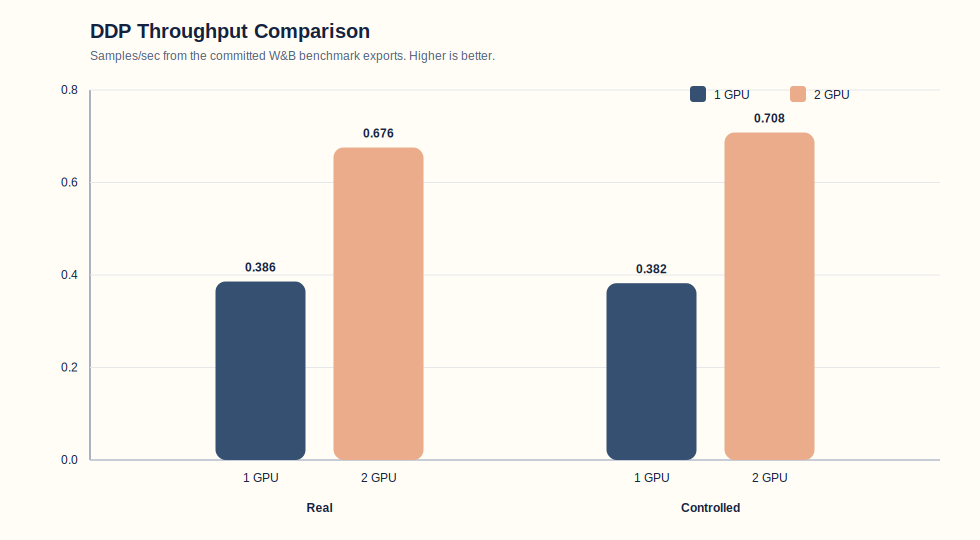
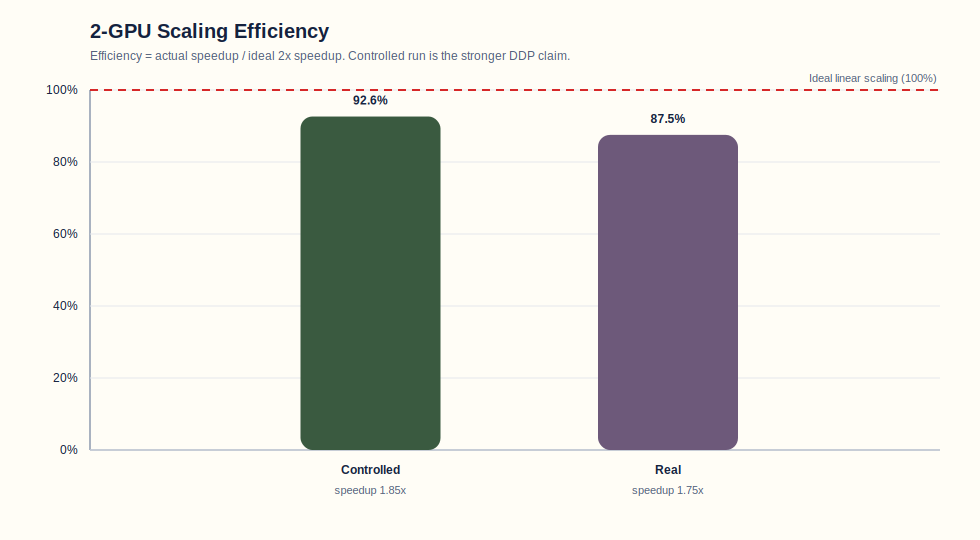

# Insurance Damage Assessment with GLM-4.6V-Flash

This project fine-tunes a vision-language model to generate insurance-style vehicle damage assessments from a single image. The final stack is built around `zai-org/GLM-4.6V-Flash`, LoRA fine-tuning, 8-bit loading, PyTorch DDP, Hugging Face dataset/model storage, and Runpod-based GPU execution.

The model takes only an image at inference time and is trained to produce a short professional assessment covering:

- damage type
- damage location
- rough severity
- estimated repair cost range

## Final Outcome

The training pipeline is working end-to-end.

- Training: successful on multi-GPU Runpod
- DDP benchmarking: completed for 1 GPU and 2 GPU
- Final model checkpoint: saved and uploaded
- Final evaluation: completed from checkpoint on the corrected test split
- Merged-model export: currently unreliable, checkpoint-based inference is the trusted path

## Why This Project Matters

This project was built to do two things:

1. Fine-tune a modern VLM for an insurance-adjuster style task.
2. Show, with measured evidence, why DDP is useful for this workload.

The main engineering argument for DDP in this project is that the model is large enough that single-GPU scaling by simply increasing batch size is constrained. The training setup already runs at `per_device_batch_size: 1`, so increasing throughput is better handled by scaling horizontally with DDP.

## Model and Training Stack

- Base model: `zai-org/GLM-4.6V-Flash`
- Fine-tuning method: LoRA via PEFT
- Quantization during training/inference: 8-bit BitsAndBytes
- Framework: PyTorch
- Distributed training: DDP via `torchrun`
- Tracking: Weights & Biases
- Dataset repo: `Raghav77/cardd_insurance_dataset`
- Checkpoint repo: `Raghav77/insurance-adjuster-glm46v-checkpoints`

## Repository Layout

```text
insurance-adjuster-vlm/
├── GLM/
│   ├── configs/
│   │   ├── benchmarks/
│   │   ├── download_dataset.yaml
│   │   └── runpod.yaml
│   ├── data/
│   │   ├── dataset.py
│   │   ├── dataset_cleanup.py
│   │   ├── download_dataset.py
│   │   ├── repair_split_images.py
│   │   ├── sampler.py
│   │   ├── train_test_split.py
│   │   ├── upload_dataset.py
│   │   └── validate_data.py
│   ├── evaluation/
│   │   ├── classification_metrics.py
│   │   ├── generation_metrics.py
│   │   ├── io.py
│   │   ├── prediction_schema.py
│   │   └── regression_metrics.py
│   ├── scripts/
│   │   ├── collator.py
│   │   ├── evaluate.py
│   │   ├── inference.py
│   │   ├── model_loader.py
│   │   ├── push_to_hub.py
│   │   ├── train.py
│   │   └── utils/
│   ├── runpod_ddp.sh
│   └── runpod_setup.sh
├── dataset/
│   ├── cleaned_dataset.json
│   ├── dataset.json
│   ├── train.json
│   ├── test.json
│   └── images/
├── README.md
└── requirements.txt
```

## Dataset Pipeline

The dataset is conversational and image-grounded. Each record looks like:

```json
{
  "id": "001516",
  "image": "001516.jpg",
  "conversations": [
    {
      "role": "user",
      "content": "You are an Insurance Adjuster. Evaluate the car damage shown in the image."
    },
    {
      "role": "assistant",
      "content": "The image shows a dent on the front left fender ... estimated repair cost is approximately $800 to $1,200."
    }
  ]
}
```

### Cleaning rationale

The original data contained metadata-derived leakage inside prompts and targets, including:

- damage category labels
- bounding boxes
- area values
- annotation artifacts

That leakage is invalid for image-only deployment. The cleaning pass removes those artifacts so the model must learn from the image itself rather than from explicit labels hidden in text.

### Dataset preparation sequence

1. Clean the raw dataset:

```bash
python3 GLM/data/dataset_cleanup.py dataset/dataset.json dataset/ --dry-run
python3 GLM/data/dataset_cleanup.py dataset/dataset.json dataset/
```

2. Create the train/test split:

```bash
python3 GLM/data/train_test_split.py dataset/cleaned_dataset.json dataset/ --dry-run
python3 GLM/data/train_test_split.py dataset/cleaned_dataset.json dataset/
```

3. Validate split files:

```bash
python3 GLM/data/validate_data.py --input dataset/train.json
python3 GLM/data/validate_data.py --input dataset/test.json
```

4. Upload the dataset snapshot:

```bash
export HF_TOKEN="<your_token>"

python3 GLM/data/upload_dataset.py \
  --repo-id Raghav77/cardd_insurance_dataset \
  --dataset-dir dataset \
  --revision main \
  --commit-message "Upload cleaned insurance dataset"
```

## Local and Runpod Setup

### Local

```bash
python3 -m venv .venv
source .venv/bin/activate
pip install -r requirements.txt
```

### Faster setup with `uv`

```bash
python3 -m pip install --upgrade uv
uv venv .venv
source .venv/bin/activate
uv pip install --python python -r requirements.txt
```

### Runpod bootstrap

```bash
INSTALLER=uv CREATE_VENV=1 AUTO_DOWNLOAD_DATASET=1 bash GLM/runpod_setup.sh
source .venv/bin/activate
```

### DDP launch

```bash
bash GLM/runpod_ddp.sh
```

The DDP launcher now prefetches the model snapshot before `torchrun` starts. This was added after repeated failures where several ranks tried to initialize the 20.6GB model simultaneously and one rank saw an incomplete local cache.

## Training Configuration

Main config: `GLM/configs/runpod.yaml`

Important runtime paths:

- train annotations: `/workspace/data/insurance_dataset/train.json`
- test annotations: `/workspace/data/insurance_dataset/test.json`
- train images: `/workspace/data/insurance_dataset/images/train`
- test images: `/workspace/data/insurance_dataset/images/test`

The training script reads `train.json` directly. It does not train from `dataset.json` or `cleaned_dataset.json` directly. Those files are upstream artifacts used to produce the split files.

## DDP Benchmarking

Two benchmark styles were used:

### 1. Real training speedup

Keep the practical training config fixed and increase GPU count. This changes effective global batch size and shows operational throughput gain.

### 2. Controlled scaling efficiency

Keep effective global batch size approximately constant while increasing GPU count. This isolates DDP efficiency more cleanly.

### Measured results

The strongest completed comparisons are the 1-GPU vs 2-GPU runs.

#### Controlled benchmark

- 1 GPU samples/sec: `0.3822`
- 2 GPU samples/sec: `0.7081`
- Speedup: `1.85x`
- Scaling efficiency: `92.6%`
- Loss stayed effectively unchanged: `8.5580` vs `8.5264`

This is the cleanest evidence that DDP helped in a controlled setting.

#### Real benchmark

- 1 GPU samples/sec: `0.3860`
- 2 GPU samples/sec: `0.6757`
- Speedup: `1.75x`
- Scaling efficiency: `87.5%`

This demonstrates practical throughput improvement, but because the effective global batch size changes with GPU count, it should be presented as operational speedup rather than pure controlled efficiency.

### Benchmark figures





These figures are generated from the committed W&B CSV exports in `reports/benchmarks/wandb_exports/` using `reports/benchmarks/plots/generate_benchmark_plots.py`.

### Why the 6-GPU benchmark was dropped

The 6x A40 Runpod environment repeatedly showed NCCL instability:

- one unhealthy pod had a broken GPU handle
- another healthy-looking pod still timed out on early NCCL collectives
- even after conservative settings like `NCCL_P2P_DISABLE=1` and `NCCL_IB_DISABLE=1`, the 6-GPU run was not stable enough to treat as reliable benchmark evidence

Final decision:

- keep the 1-GPU and 2-GPU benchmark results
- drop the 6-GPU benchmark from the final evidence set
- document the 6-GPU instability as an infrastructure limitation, not a model result

## Final Training Run

The final training checkpoint used for evaluation was produced successfully and preserved separately from the merged-model export.

Observed training behavior:

- early loss decreased quickly
- later epochs plateaued around the mid-`5.x` range
- checkpoint-based inference from `last.pt` produced coherent insurance-style outputs

This is important: the checkpoint itself is valid.

## Final Evaluation

The trustworthy final evaluation path is checkpoint-based evaluation, not merged-model evaluation.

Final evaluation command:

```bash
CUDA_VISIBLE_DEVICES=0 python3 -m GLM.scripts.evaluate \
  --config GLM/configs/runpod.yaml \
  --checkpoint /workspace/outputs/checkpoints/last.pt \
  --split test \
  --output-dir /workspace/outputs/final_eval_checkpoint \
  --num-workers 0 \
  --log-every 1 \
  --save-predictions
```

### Final checkpoint-based test metrics

```json
{
  "eval_loss": 5.606945405135283,
  "generation": {
    "bleu": 0.11326108418621052,
    "exact_match": 0.0,
    "meteor": 0.4330256529954468,
    "normalized_exact_match": 0.0,
    "rouge1": 0.3980921855068373,
    "rouge2": 0.19864659053736533,
    "rougeL": 0.28664757294174537,
    "rougeLsum": 0.28621917582244266
  },
  "loss_sum": 414.913959980011,
  "num_batches": 74.0,
  "num_examples": 74.0,
  "num_prediction_records": 74,
  "token_accuracy": 0.12492929181440654,
  "token_correct": 9055.0,
  "token_count": 72481.0
}
```

### Qualitative behavior

The final checkpoint produces coherent, insurance-style free-form assessments. Typical outputs correctly identify:

- front or rear damage location
- dent/scratch/body-panel issues
- plausible repair-cost ranges

The main remaining quality issues are:

- occasional over-generation
- repeated phrasing
- stray reasoning tags like `<think></think>`
- some damage-category drift, especially between scratches and dents
- some cost overestimation on harder cases

## Critical Bottlenecks and How They Were Resolved

This project hit several real engineering problems during development and execution.

### 1. Dataset leakage

Problem:

- metadata such as labels, bbox values, and area values were leaking into prompts/targets

Fix:

- `GLM/data/dataset_cleanup.py` was added and refined to remove direct leakage from prompts and obvious annotation artifacts from targets

### 2. Split pathing errors on Runpod

Problem:

- train/test images were stored under split-specific directories
- training/evaluation initially used the wrong shared image-root logic

Fix:

- `GLM/configs/runpod.yaml` was updated to use `train_image_root` and `test_image_root`
- `GLM/scripts/train.py` and `GLM/scripts/evaluate.py` were patched to prefer split-specific roots

### 3. `max_steps` ignored during smoke tests

Problem:

- `--max-steps 5` still ran a full epoch

Fix:

- `GLM/scripts/train.py` now enforces `max_steps` immediately after optimizer-step increments, not only after the epoch ends

### 4. GradScaler deprecation

Problem:

- `torch.cuda.amp.GradScaler(...)` deprecation warning

Fix:

- moved to `torch.amp.GradScaler("cuda", ...)`

### 5. `use_cache` and gradient checkpointing warning

Problem:

- runtime warning about `use_cache=True` being incompatible with checkpointing

Fix:

- `GLM/scripts/model_loader.py` now explicitly forces `use_cache=False` when gradient checkpointing is enabled

### 6. Runpod repo noise from installed libraries

Problem:

- local environment directories on the pod polluted `git status`

Fix:

- `.gitignore` was updated to ignore venv and run artifacts appropriately

### 7. Dataset split mismatch

Problem:

- `train.json` and `test.json` did not match the images inside `images/train` and `images/test`
- this silently caused train and test samples to be dropped

Fix:

- `GLM/data/repair_split_images.py` was added
- split directories were repaired and then cleaned so they contained only the images referenced by their corresponding JSON files

### 8. Missing evaluation entrypoint

Problem:

- `python -m GLM.scripts.evaluate ...` exited immediately with no output

Fix:

- `evaluate.py` was missing `if __name__ == "__main__": main()`
- this was added

### 9. Missing metric dependencies during evaluation

Problem:

- ROUGE evaluation failed because `absl-py` and `rouge-score` were not installed

Fix:

- added the missing dependencies to `requirements.txt`

### 10. Broken merged-model inference

Problem:

- checkpoint-based inference produced coherent outputs
- merged-model inference produced multilingual/code-like garbage

What this means:

- the training checkpoint is valid
- the merged export path is currently not trustworthy

Mitigation:

- preserve and use the checkpoint as the canonical artifact
- store it separately in a checkpoint repo
- validate export locally before ever pushing a merged model again

### 11. DDP model-download race

Problem:

- multiple ranks tried to initialize `GLM-4.6V-Flash` simultaneously from Hugging Face
- one rank observed an incomplete local snapshot and failed

Fix:

- `GLM/runpod_ddp.sh` now prefetches the model snapshot once before launching `torchrun`

## Current Artifact Strategy

### Trusted artifact

- Checkpoint repo: `Raghav77/insurance-adjuster-glm46v-checkpoints`

This repo contains:

- `last.pt`
- `runpod.yaml`

This is the reliable recovery and evaluation artifact.

### Untrusted artifact

- Merged model repo: `Raghav77/insurance-adjuster-glm46v-lora-merged`

This merged export currently loads but produces garbage outputs. It should not be treated as the final model artifact until the merge/export path is fixed.

## Tracked Reports

The repository now keeps the project outputs that are safe and useful to version:

- evaluation metrics: `reports/evaluation/final_eval_checkpoint/metrics/test_metrics.json`
- evaluation predictions: `reports/evaluation/final_eval_checkpoint/predictions.jsonl`
- per-rank raw prediction dump: `reports/evaluation/final_eval_checkpoint/predictions/test_rank_0.jsonl`
- W&B benchmark exports: `reports/benchmarks/wandb_exports/`
- benchmark plot generator and rendered figures: `reports/benchmarks/plots/`

Local W&B run files, `.wandb` binaries, and debug logs are intentionally not committed.

## Recommended Usage Going Forward

### Training

```bash
CUDA_VISIBLE_DEVICES=0,1,2,3 \
CONFIG_PATH=GLM/configs/runpod.yaml \
OUTPUT_DIR=/workspace/outputs/final_train_g4 \
NPROC_PER_NODE=4 \
bash GLM/runpod_ddp.sh
```

### Single-image checkpoint inference

```bash
CUDA_VISIBLE_DEVICES=0 python3 -m GLM.scripts.inference \
  --config GLM/configs/runpod.yaml \
  --checkpoint /workspace/outputs/checkpoints/last.pt \
  --image /workspace/data/insurance_dataset/images/test/003619.jpg \
  --prompt "You are an Insurance Adjuster. Evaluate the car damage shown in the image."
```

### Final evaluation from checkpoint

```bash
CUDA_VISIBLE_DEVICES=0 python3 -m GLM.scripts.evaluate \
  --config GLM/configs/runpod.yaml \
  --checkpoint /workspace/outputs/checkpoints/last.pt \
  --split test \
  --output-dir /workspace/outputs/final_eval_checkpoint \
  --num-workers 0 \
  --log-every 1 \
  --save-predictions
```
